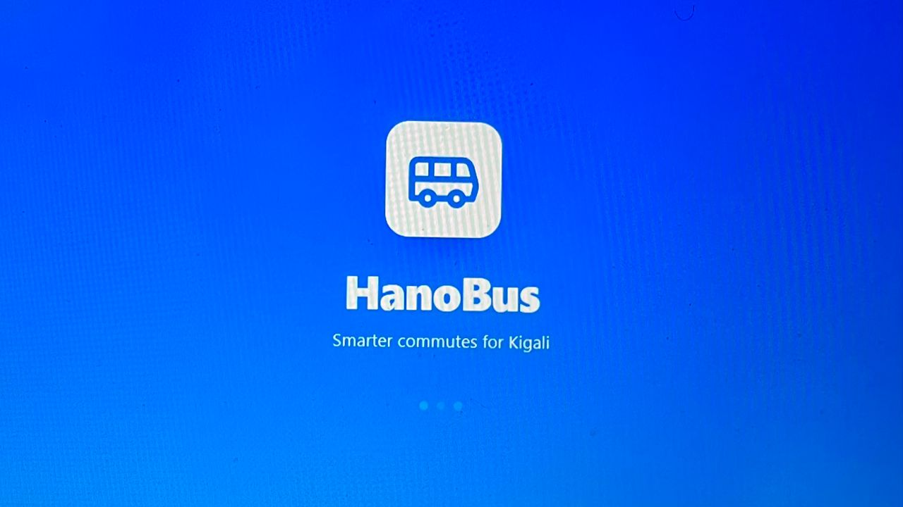
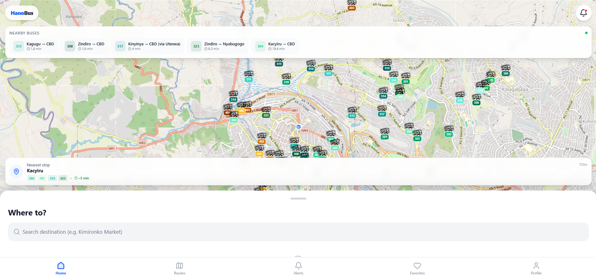
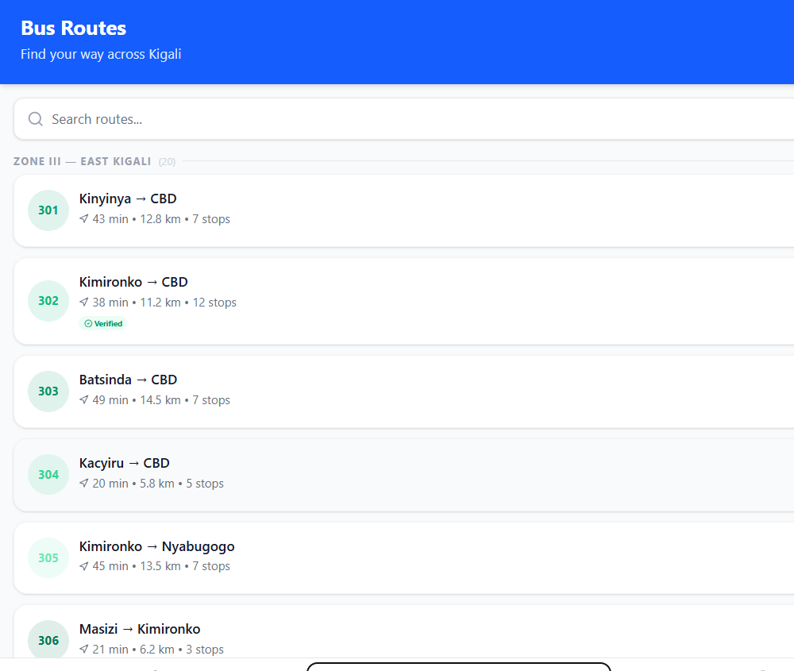

<div align="center">

<!-- HanoBus Logo / Banner -->


# HanoBus

**Real-time public transport tracking for Kigali.**

[](#)
[](./LICENSE)
[](#)
[](#)

[Live Demo](https://hano-route-reveal.lovable.app/) · [Report Bug](../../issues/new?template=bug_report.md) · [Request Feature](../../issues/new?template=feature_request.md)

</div>

---

## The Problem

Public transport in Kigali is a daily source of uncertainty. Commuters do not know when the next bus will arrive, which route to take, whether a bus is full, or if a delay or disruption is affecting their journey. Static schedules (where they exist) rarely match reality, and information is fragmented across operators, stops, and languages. The result is wasted time, missed appointments, and a transport system that feels chaotic even when the buses are running.

## Our Solution

**HanoBus** brings real-time visibility to Kigali's public transport network. It shows live bus positions on a map, estimates arrival times for each stop, suggests the best route between any two points, and alerts users to delays or disruptions — all in Kinyarwanda, French, or English. Whether you're a student, a commuter, or a visitor, HanoBus turns the city's bus network into something you can actually plan around.

## Features

- 🗺️ **Live GPS bus tracking** — see every bus on the map, updated in real time
- ⏱️ **Real-time arrival estimates** — know exactly when your bus will reach your stop
- 🧭 **Intelligent route planning** — shortest, fastest, and least-crowded routes
- 🌐 **Multi-language** — Kinyarwanda, French, and English
- 🔔 **Push notifications** — delays, detours, and service disruptions
- ⭐ **Favorites** — save your frequent stops and routes
- 📴 **Offline-first** — core features work without a connection

## Tech Stack

| Layer          | Technology                                   | Purpose                                        |
|----------------|----------------------------------------------|------------------------------------------------|
| Frontend       | React 19 + TypeScript + Vite                 | Fast, modern SPA with type safety              |
| Styling        | Tailwind CSS v4                              | Utility-first, responsive UI                   |
| State          | Zustand                                      | Lightweight global state                       |
| Routing        | React Router v7                              | Client-side navigation                         |
| Maps           | Google Maps + Leaflet                        | Live map rendering and bus overlays            |
| Backend        | Firebase                                     | Serverless backend platform                    |
| Database       | Cloud Firestore                              | Real-time sync of bus positions and routes     |
| Auth           | Firebase Auth                                | Email/password + Google Sign-In                |
| Functions      | Firebase Cloud Functions                     | Server-side logic and scheduled jobs           |
| Notifications  | Firebase Cloud Messaging (FCM)               | Push notifications for delays and alerts       |
| PWA            | vite-plugin-pwa + Workbox                    | Installable, offline-capable web app           |
| AI             | Google GenAI (Gemini)                        | Smart assistance and natural-language search   |

## Getting Started

### Prerequisites

- Node.js 20 or newer
- npm 10 or newer
- A Firebase project (Firestore, Auth, FCM enabled)
- A Google Maps API key

### Installation

```bash
# 1. Clone the repo
git clone https://github.com/<your-org>/hanobus.git
cd hanobus

# 2. Install dependencies
npm install

# 3. Configure environment variables
cp .env.example .env.local
# then fill in your Firebase + Google Maps keys in .env.local

# 4. Start the dev server
npm run dev
```

The app will be available at `http://localhost:3000`.

### Available Scripts

| Script            | Description                           |
|-------------------|---------------------------------------|
| `npm run dev`     | Start the Vite dev server             |
| `npm run build`   | Build the production bundle           |
| `npm run preview` | Preview the production build locally  |
| `npm run lint`    | Type-check the project with `tsc`     |
| `npm run format`  | Format the codebase with Prettier     |

## Project Structure

```
hanobus/
├── public/                  # Static assets (icons, banner, manifest)
├── scripts/                 # Build / seeding scripts
├── src/
│   ├── components/          # Reusable UI components
│   │   ├── BottomNav.tsx
│   │   ├── Map.tsx
│   │   ├── Onboarding.tsx
│   │   └── ...
│   ├── pages/               # Route-level screens
│   │   ├── Home.tsx
│   │   ├── RoutesPage.tsx
│   │   ├── AlertsPage.tsx
│   │   └── ...
│   ├── data/                # Static route/stop data
│   ├── i18n/                # Kinyarwanda / French / English strings
│   ├── services/            # Firebase + API services
│   ├── store/               # Zustand stores
│   ├── utils/               # Helpers
│   ├── firebase.ts          # Firebase initialization
│   ├── App.tsx              # App shell
│   └── main.tsx             # Entry point
├── firestore.rules          # Firestore security rules
├── vite.config.ts
└── package.json
```

## Screenshots

<div align="center">

| Home | Live Map | Route Detail |
|------|----------|--------------|
|  |  |  |

</div>

> Replace these placeholders with real screenshots in `public/screenshots/`.

## Team

| Name                 | Role            |
|----------------------|-----------------|
| **Gacaca Godwin**    | Lead Developer  |
| **Uwase Furaha**     | Developer       |
| **Nyiramugisha Safi**| Developer       |

## Live Demo

🌍 **[hano-route-reveal.lovable.app](https://hano-route-reveal.lovable.app/)**

## 📚 Documentation

| Document | Description |
|----------|-------------|
| [Project Overview](PROJECT.md) | One-page summary of HanoBus for judges and new visitors |
| [Architecture](docs/ARCHITECTURE.md) | System design and data flow |
| [API Reference](docs/API.md) | Cloud Functions documentation |
| [Database Schema](docs/DATABASE.md) | Firestore collections and structure |
| [Setup Guide](docs/SETUP.md) | Detailed developer setup |
| [Deployment](docs/DEPLOYMENT.md) | How to deploy to production |
| [Testing](docs/TESTING.md) | Testing strategy and checklist |
| [Security Policy](SECURITY.md) | Data handling and vulnerability reporting |

## Contributing

Contributions are welcome! Please read [CONTRIBUTING.md](./CONTRIBUTING.md) before opening a pull request.

## License

This project is licensed under the MIT License — see the [LICENSE](./LICENSE) file for details.

---

<div align="center">

Built for the **Tech Builder Program Hackathon 2026** 🇷🇼

Made with ❤️ in Kigali, Rwanda.

</div>
